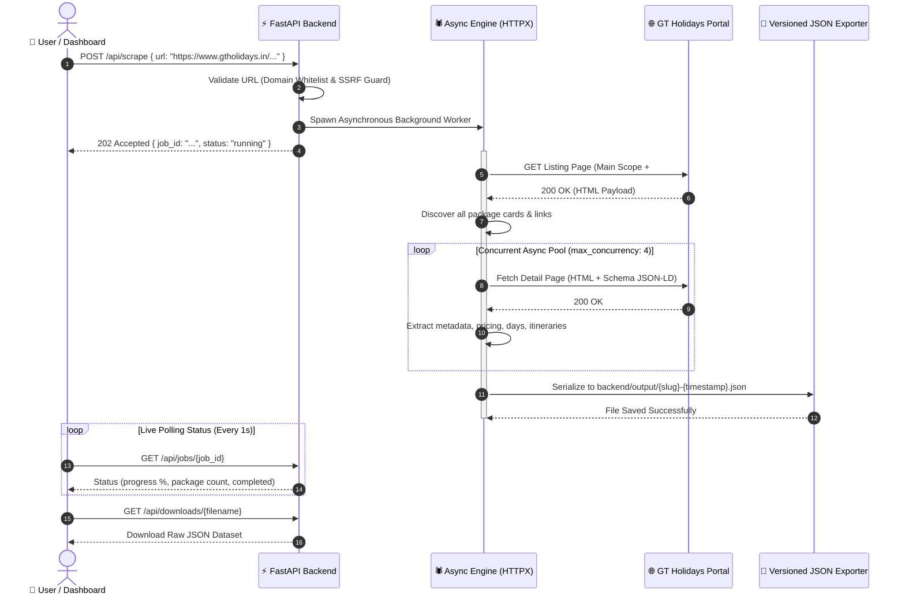

<p align="center">
  
</p>

<p align="center">
  <a href="https://github.com/GANESHAATHI46/gtscrapper">
    
  </a>
</p>

<p align="center">
  <a href="https://github.com/GANESHAATHI46/gtscrapper/stargazers"></a>
  <a href="https://github.com/GANESHAATHI46/gtscrapper/network/members"></a>
  
  
  
  
  
  
  
</p>

---

<p align="center">
  <a href="#-key-features"><b>✨ Features</b></a> •
  <a href="#%EF%B8%8F-interactive-architecture--workflow"><b>🏗️ Architecture</b></a> •
  <a href="#-terminal-execution-preview"><b>💻 Terminal Demo</b></a> •
  <a href="#-quick-start-guide"><b>🚀 Quick Start</b></a> •
  <a href="#-rest-api-endpoints"><b>📡 API Reference</b></a> •
  <a href="#-automated-testing"><b>🧪 Testing</b></a>
</p>

---

## ✨ Key Features

<table>
  <tr>
    <td width="50%">
      <h3>🌐 Universal Generic Scraper</h3>
      <p>Zero destination-specific hardcoded rules. Automatically scrapes any GT Holidays domestic or international listing (e.g. <i>Delhi, Kerala, Goa, Kashmir, Dubai, Singapore, Thailand, Europe</i>).</p>
    </td>
    <td width="50%">
      <h3>⚡ Dynamic Card Discovery</h3>
      <p>Scans the main package listing scope and dynamically uncovers hidden cards loaded inside <code>#gt-more-packages</code> (View More) without dropping records.</p>
    </td>
  </tr>
  <tr>
    <td width="50%">
      <h3>🧭 Dynamic Schema & Breadcrumbs</h3>
      <p>Robust metadata resolution chain: <code>Schema.org BreadcrumbList</code> ➔ HTML breadcrumbs ➔ Page metadata ➔ H1 ➔ OpenGraph ➔ Normalized URL segments.</p>
    </td>
    <td width="50%">
      <h3>💱 Multi-Currency & Price Intelligence</h3>
      <p>Detects numeric amounts and ISO currencies (<code>₹/INR</code>, <code>$/USD</code>, <code>AED</code>, <code>€/EUR</code>, <code>£/GBP</code>). Safely sets missing or "On Request" pricing as <code>null</code>.</p>
    </td>
  </tr>
  <tr>
    <td width="50%">
      <h3>📅 Day-by-Day Structured Itinerary</h3>
      <p>Extracts ordered timeline schedules with day indices, activity titles, rich narrative descriptions, and tour inclusions.</p>
    </td>
    <td width="50%">
      <h3>💾 Versioned JSON Persistence</h3>
      <p>Auto-generates versioned datasets in <code>backend/output/{destination-slug}-tour-packages-{timestamp}.json</code> with non-destructive runs.</p>
    </td>
  </tr>
  <tr>
    <td width="50%">
      <h3>🛡️ Built-in SSRF & Concurrency Guard</h3>
      <p>Enforces strict domain whitelisting (<code>*.gtholidays.in</code>), backoff retry strategies, and rate-regulated asynchronous worker pools.</p>
    </td>
    <td width="50%">
      <h3>💎 Modern Interactive Web Dashboard</h3>
      <p>Clean React + Vite single-page application with real-time job polling, progress bars, searchable table, itinerary inspector modal, and instant JSON download.</p>
    </td>
  </tr>
</table>

---

## 🏗️ Interactive Architecture & Workflow



---

## 💻 Terminal Execution Preview

```ansi
╭─────────────────────────────────────────────────────────────────────────────╮
│  ★ GT HOLIDAYS HIGH-PERFORMANCE SCRAPER ENGINE v1.0.0                       │
│  Target: https://www.gtholidays.in/kerala-tour-packages/                     │
╰─────────────────────────────────────────────────────────────────────────────╯
[i] Initializing Async Engine with 4 concurrent workers...
[+] Discovered 28 packages (including 12 loaded inside #gt-more-packages)
[●] [1/28] Munnar Scenic Getaway ......... ₹14,999 (3N/4D) [OK]
[●] [2/28] Wayanad Wilderness Trek ....... ₹18,500 (4N/5D) [OK]
[●] [3/28] Alleppey Houseboat Cruise ..... ₹21,200 (2N/3D) [OK]
[●] [4/28] Kerala Honeymoon Special ...... ₹29,999 (5N/6D) [OK]
✔ Pipeline completed in 8.42s!
💾 Saved versioned JSON: backend/output/kerala-tour-packages-20261005-121500.json
```

---

## 📂 Project Structure

```text
gtscraper/
│
├── 📂 backend/
│   ├── 📂 app/
│   │   ├── main.py                    # FastAPI entrypoint, CORS, routing
│   │   ├── config.py                  # Settings, timeouts, concurrency, SSRF guard
│   │   ├── 📂 api/
│   │   │   └── routes.py              # REST endpoints (health, scrape, jobs, download)
│   │   ├── 📂 scraper/
│   │   │   ├── listing.py             # Generic listing detector & link discoverer
│   │   │   ├── package.py             # Package detail scraper coordinator
│   │   │   ├── parser.py              # Pure HTML extraction functions
│   │   │   ├── metadata.py            # Dynamic breadcrumbs & schema metadata resolver
│   │   │   ├── client.py              # Async HTTPX client with retry and backoff
│   │   │   └── utils.py               # SSRF guards, currency/price parser, slugify
│   │   ├── 📂 models/
│   │   │   └── package.py             # Strict Pydantic models & validation
│   │   ├── 📂 services/
│   │   │   └── scraper_service.py     # Background job manager & state machine
│   │   └── 📂 exporters/
│   │       └── json_exporter.py       # Versioned JSON serializer
│   ├── 📂 output/                     # Exported versioned JSON datasets
│   ├── 📂 tests/
│   │   ├── test_scraper.py            # Unit tests for utils and parsers
│   │   ├── test_live_integration.py   # Live multi-destination integration tests
│   │   ├── test_kerala_acceptance.py  # Acceptance suite for Kerala packages
│   │   └── test_transformers.py       # Data transformation tests
│   ├── pytest.ini
│   └── requirements.txt
│
└── 📂 frontend/
    ├── 📂 src/
    │   ├── App.tsx                    # Main interactive dashboard
    │   ├── App.css                    # Polished design system with glassmorphism
    │   ├── types.ts                   # TypeScript interfaces
    │   └── 📂 components/
    │       ├── URLInput.tsx           # URL input with UI presets (Kerala, Dubai, Delhi, etc.)
    │       ├── ProgressTracker.tsx    # Live animated step-by-step progress monitor
    │       ├── PackageTable.tsx       # Searchable, sortable & filterable package table
    │       ├── PackageDetailModal.tsx # Itinerary accordion & media modal
    │       └── JSONViewer.tsx         # JSON preview & copy modal
    ├── package.json
    └── vite.config.ts
```

---

## 🚀 Quick Start Guide

<details open>
<summary><b>1. 🐍 Backend Setup (FastAPI)</b></summary>

Open Windows PowerShell in the project root:

```powershell
# Create virtual environment
python -m venv .venv

# Activate virtual environment
.venv\Scripts\Activate.ps1

# Install dependencies
pip install -r backend\requirements.txt

# Run the FastAPI server
cd backend
uvicorn app.main:app --reload --port 8000
```

- 🌐 **API Base**: [http://localhost:8000](http://localhost:8000)
- 📖 **Swagger Interactive Docs**: [http://localhost:8000/docs](http://localhost:8000/docs)
- 🩺 **Health Check**: [http://localhost:8000/api/health](http://localhost:8000/api/health)

</details>

<details open>
<summary><b>2. ⚛️ Frontend Setup (React + Vite)</b></summary>

Open a second Windows PowerShell terminal:

```powershell
cd frontend

# Install node dependencies
npm install

# Start the Vite development server
npm run dev
```

- 🖥️ **Interactive Web App**: [http://localhost:5173](http://localhost:5173)

</details>

---

## 📡 REST API Endpoints

| Method | Endpoint | Description |
| :--- | :--- | :--- |
| `GET` | `/api/health` | Service health & uptime probe |
| `POST` | `/api/scrape` | Trigger an async scrape job for a GT Holidays listing URL |
| `GET` | `/api/jobs/{job_id}` | Poll real-time scrape job progress & status |
| `GET` | `/api/downloads/{filename}` | Download generated versioned JSON output |

---

## 🧪 Automated Testing

Run the test suite with verbose reporting:

```powershell
cd backend
..\.venv\Scripts\pytest tests -v
```

<details>
<summary><b>🧪 Test Coverage Highlights</b></summary>

- `test_scraper.py`: Tests HTML parsing, price/currency normalization, and SSRF domain security checks.
- `test_live_integration.py`: Validates live extraction on domestic & international packages.
- `test_kerala_acceptance.py`: Strict validation of package counts, breadcrumbs, and itineraries.
- `test_transformers.py`: Validates data serialization and schema contracts.

</details>

---

<p align="center">
  <sub>Built with ❤️ for generic web scraping and modern data visualization.</sub>
</p>

<p align="center">
  
</p>

